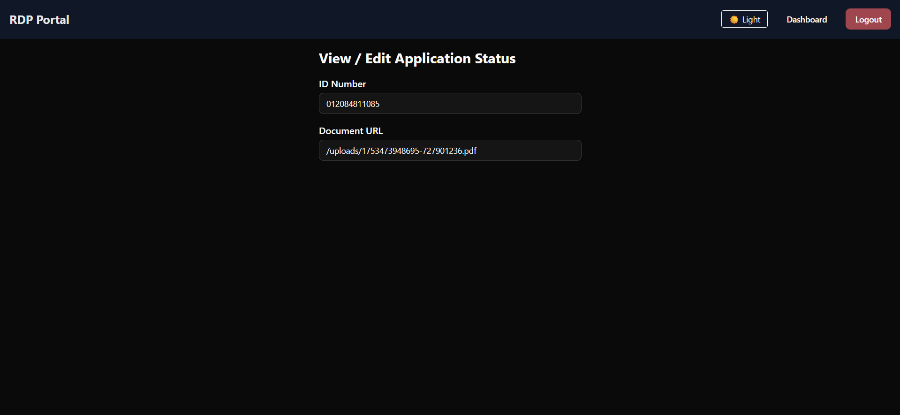
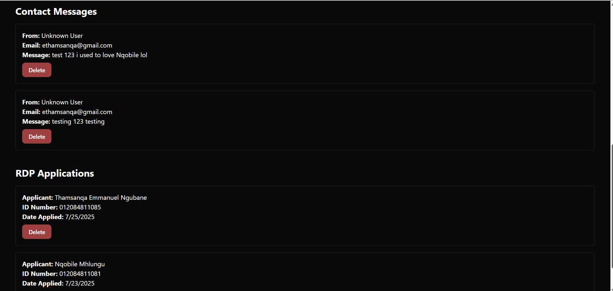

# RDP Management System (MERN Stack)
This project is an online platform where South African users can apply for and manage their RDP (Reconstruction and Development Programme) applications. It provides user registration, login, application submission, status tracking, and admin management capabilities.

Features
User Registration & Login with JWT authentication

User Dashboard to apply for RDPs, view and update applications

Admin Dashboard to manage users, applications, and contact feedback

File upload support for application documents

Contact form for user feedback

Responsive UI built with React and styled with shadcn/ui components

Dark mode toggle across the site

MongoDB backend for storing users, applications, and contacts

RESTful API built with Express.js and secured routes using JWT

Tech Stack
Frontend	Backend	Database	Other
React (Vite)	Node.js + Express.js	MongoDB	JWT for auth
Tailwind CSS + shadcn/ui	Multer for file uploads	Mongoose ODM	bcryptjs for passwords
React Router	Custom middleware (auth, admin)		dotenv for env vars

Folder Structure
bash
Copy
Edit
MERN-FINAL-PROJECT
├── client/                     # React frontend
│   ├── src/
│   │   ├── components/         # UI components (ApplyForm, ContactForm, Login, Register, Navbar, etc.)
│   │   ├── pages/              # Main pages (Dashboard, AdminDashboard, AuthPage, Index)
│   │   └── services/           # API helper with Axios calls
├── server/                     # Backend Express API
│   ├── controllers/            # Route controllers for User, Application, Contact, Admin
│   ├── middleware/             # Auth & Admin middlewares, Multer config
│   ├── models/                 # Mongoose models (User, Application, Contact)
│   ├── routes/                 # Express route definitions
│   ├── uploads/                # Uploaded application documents
│   ├── config/                 # DB and multer configs
│   └── server.js               # Entry point
├── README.md                   # This file
└── package.json, pnpm-lock.yaml # Project config files
Getting Started
Prerequisites
Node.js (v16+ recommended)

MongoDB (local or Atlas)

pnpm or npm package manager

Installation
Clone the repo

git clone https://github.com/ThamsanqaEmmanuel/MERN-FINAL-PROJECT.git
cd rdp-management-system
Install backend dependencies

cd server
pnpm install
Install frontend dependencies

cd ../client
pnpm install
Set environment variables

Create a .env file in server/ folder with at least:

PORT=5000
MONGODB_URI= insert your connection link
JWT_SECRET=your_jwt_secret_key
Run the backend

cd ../server
pnpm run dev
Run the frontend

cd ../client
pnpm run dev
Open your browser at http://localhost:5173 (or the port your frontend uses).

Usage
Visit the landing page to see project info and sliding RDP pictures.

Register a new user (must confirm oath checkbox).

Login with your credentials.

Access your dashboard to apply for an RDP.

Upload required documents and enter your ID number and date applied.

View and edit your application status.

Use the contact form to send feedback.

Admin users can manage all users, applications, and contact messages via the Admin Dashboard.

Notes
All API requests are authenticated with JWT tokens.

Uploaded files are stored in the server/uploads folder.

Admin routes are protected and require admin privileges.

The frontend stores JWT token and user info in localStorage.

Admin Dashboard
